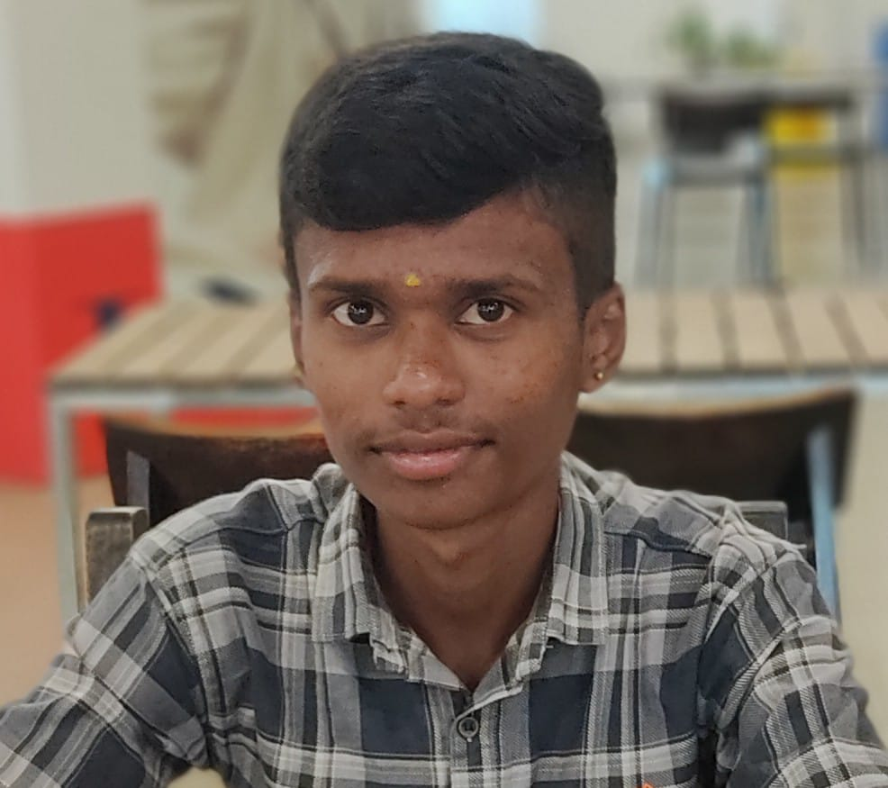

# 🌐 My Portfolio — Preetham Gowda S

Welcome to my personal portfolio website!  
This website showcases my skills, projects, and interests — built using *HTML, **CSS*, and pure passion 💻✨

🔗 *Live Demo:*  
👉 [View My Portfolio](https://preetamgowdas44-cpu.github.io/My-portfolio-Kannadiga/)

---

## 🧩 About
Hi, I’m *Preetham Gowda S, an aspiring **Web Developer* from Karnataka 🇮🇳.  
I love designing creative and responsive web pages using modern HTML and CSS.

---

## 🚀 Features
- Responsive layout for all devices 📱💻  
- Sections: About Me, Skills, Projects, Contact  
- Kannada-inspired theme 🇮🇳  
- Background image with stylish design  

---

## 🛠️ Technologies Used
- *HTML5*
- *CSS3*
- *GitHub Pages* for hosting  

---

## 📸 Preview

---

## 📬 Contact
📧 *Email:* yourname@gmail.com  
💼 [LinkedIn Profile](https://www.linkedin.com/in/preetam-gowda-s-320558389?utm_source=share&utm_campaign=share_via&utm_content=profile&utm_medium=android_app)  
🐙 [GitHub Profile](https://github.com/preetamgowdas44-cpu)

---

⭐ If you like this project, don’t forget to give it a star! ⭐
